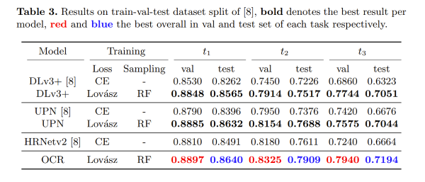

# Effective Semantic Segmentation in Cataract Surgery: What matters most? 
#### To appear at MICCAI 2021


> [**Effective Semantic Segmentation in Cataract Surgery: What matters most?**](https://arxiv.org/pdf/2108.06119),            
> [Theodoros Pissas*](https://rvim.online/author/theodoros-pissas/), [Claudio S. Ravasio*](https://rvim.online/author/claudio-ravasio/), [Lyndon Da Cruz](), [Christos Bergeles](https://rvim.online/author/christos-bergeles/)  <br>
> *arXiv technical report ([arXiv 2108.06119](https://arxiv.org/pdf/2108.06119))*


## Introduction

This repository contains the implementation and model weights 
of the methods presented in the paper "Effective semantic segmentation in Cataract Surgery: What matters most?", presented at MICCAI 2021.

##### Abstract

Our work proposes neural network design choices that set the
state-of-the-art on a challenging public benchmark on cataract surgery,
CaDIS. Our methodology achieves strong performance across three semantic segmentation tasks with increasingly granular surgical tool class
sets by effectively handling class imbalance, an inherent challenge in
any surgical video. We consider and evaluate two conceptually simple
data oversampling methods as well as different loss functions. We show
significant performance gains across network architectures and tasks especially on the rarest tool classes, thereby presenting an approach for
achieving high performance when imbalanced granular datasets are considered. 

## Data and requirements
1) CaDIS dataset can be found here [here](https://cataracts.grand-challenge.org/CaDIS/)

2) Create conda environment with pytorch 1.7 and CUDA 10.0
    ```bash
    # Create conda environment with torch 1.0.1 and CUDA 10.0
    conda env create -f environment.yml 
    conda activate SemSegCat
    ```

## Train
To train a model we specify most settings using json configuration files found in ```configs```. 

For for training with repeat factor sampling and Lovasz on task 2:
- For OCRNet :
    ```bash
    python main.py -c configs/OCRNet_t2.json -d 0 --data_path "path_to_data/segmentation"
    ```
- For DeepLabv3Plus training with repeat factor sampling and Lovasz on task 2:
    ```bash
    python main.py -c configs/DeepLabv3Plus_t2.json -d 0 --data_path "path_to_data/segmentation"
    ```
For running on tasks 1 or 3 use the corresponding configurations files that contain 't1' and 't3' in the filenames.
 
 
## Applying blacklisting and/or using relabelled data
We identified significantly mislabelled images in the dataset which we exclude. We refer to this as  <em> blacklisting </em>. For a small part of those images we also provide corrected labels.
Part of the results in the paper is reported on this filtered version of the dataset. The ids of the frames that can be <em> blacklisted </em> can be found in ```data/data.csv```. 

- To apply blacklisting: 
    ```bash
    python main.py -c path_to_configuration --data_path "path_to_data/segmentation" --blacklisting True
    ```
- To use the 40 relabelled images please move the directory ```relabelled``` inside the your CaDIS data directory at ```data_path/CADIS/segmentation/```. Then run
    ```bash
    python main.py -c path_to_configuration --data_path "path_to_data/segmentation" --use_relabelled True
    ```
- To do both of the above:
    ```bash
    python main.py -c path_to_configuration --data_path "path_to_data/segmentation" --blacklisting True --use_relabelled True
    ```
These can be used in both train and inference modes. 
  
## Run a pretrained model on the test set
We provide model weights of our top-performing model on all 3 tasks of the CaDIS dataset.
1) Download checkpoint directories using the links provided at the table below.
2) Move the downloaded directories inside ```logs```. Note: to use the pretrained models the directory names must NOT be modified.
3) For test set inference on task 1,2,3 run 
    ```bash
    python main.py -c configs/OCRNet_pretrained_t1.json -d 0 --data_path "path_to_data/segmentation"
    python main.py -c configs/OCRNet_pretrained_t2.json -d 0 --data_path "path_to_data/segmentation"
    python main.py -c configs/OCRNet_pretrained_t3.json -d 0 --data_path "path_to_data/segmentation"
    ```


## Pretrained Models
Pretrained models can be found [here](https://drive.google.com/drive/folders/1Tv9Br1VClB7JzpjgStmQLAFb6Aavdf_v?usp=sharing)
##### Trained on CaDIS Dataset train-val-test split
|Task       | Backbone  | Model     | Loss       | Sampling      | CKPT    | args to train | args for inference |
| --------- | --------- | ----------| ---------- | ---------     | ------- | ----------      | ---------- |
| 1         | ResNet-50 | OCR       | Lovasz     | Repeat Factor | [ckpt](https://drive.google.com/drive/folders/1btnFihg8gIssxFg2UmZXjr0NjS343rDQ?usp=sharing) |```-c configs/OCRNet.json -t 1```| ```-c configs/OCRNet_pretrained_t1.json```|
| 2         | ResNet-50 | OCR       | Lovasz     | Repeat Factor | [ckpt](https://drive.google.com/drive/folders/1Z5AZ5aNCaNDi1zGArQTzAOt8uCVLmnRy?usp=sharing) |```-c configs/OCRNet.json -t 2```| ```-c configs/OCRNet_pretrained_t2.json```|
| 3         | ResNet-50 | OCR       | Lovasz     | Repeat Factor | [ckpt](https://drive.google.com/drive/folders/1igYtGpwk8s6oirH5rCz1XF0YIxHwxRuh?usp=sharing) |```-c configs/OCRNet.json -t 3```| ```-c configs/OCRNet_pretrained_t3.json```|

The provided models achieve SOTA performance as shown in the table below: 




## Qualitative results
Qualitative results on unseen surgical video can be found [here](https://youtu.be/twVIPUj1WZM).

## Citation
```
@article{SemSegCat2021,
  title={Effective semantic segmentation in Cataract Surgery: What matters most?},
  author={Pissas, Theodoros and Ravasio, Claudio and Da Cruz, Lyndon and Bergeles, Christos},
  journal={arXiv preprint arXiv:2108.06119},
  year={2021}
}
```
